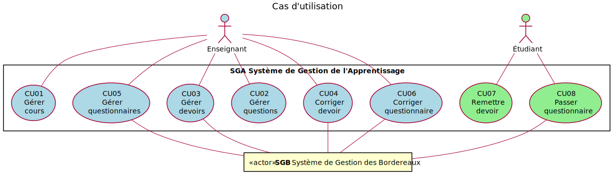

# Exigences SGA

<!-- deux espaces à la fin pour faire un saut de ligne -->Version : Été 2022 (1.0.0)  
Si vous trouvez des incohérences ou vous avez des questions, utilisez les [issues](https://github.com/profcfuhrmanets/log210-enonce-lab1/issues).

- [README.md](./README.md)
- [Pour les auxiliaires d'enseignement: Grille de pointage des exigences](https://docs.google.com/spreadsheets/d/e/2PACX-1vSv41don0mUrXlng6Uk46yrKrKPZ1P4jbDLBi6qEO0s3pybZ93uAwBlkKqG6HD6AA/pubhtml?gid=1269446979&single=true)

## Introduction

Dans cette étude de cas, il est proposé de réaliser un système de gestion de l'apprentissage (SGA) qui ressemble à Moodle utilisé dans une université. La réalisation est principalement l'application dorsale (back-end), mais il faudra avoir une application frontale (front-end) minimaliste, p. ex. des pages web statiques (ou avec un peu de JavaScript), pour démontrer les fonctionnalités.

## Parties prenantes et intérêts

- **Enseignant.e :** Une personne employée par l'université et qui est responsable d'enseigner un groupe-cours offert par l'université. Si elle décide d'utiliser le SGA pour son groupe-cours (c'est facultatif, il peut y avoir des groupes-cours où SGA n'est pas utilisé), alors elle veut un moyen de gérer toutes les facettes de l'application d'apprentissage.

- **Étudiant.e :** Une personne inscrite à l'université. Elle veut un moyen de remettre des devoirs et de réaliser des jeux-questionnaires pour les groupes-cours dans lesquels elle est inscrite.

## Survol des fonctionnalités



## Importance des fonctionnalités

La vraie valeur ajoutée du SGA est dans les cas d'utilisation indiqués par une étoile (*) dans le graphe suivant.
Par exemple, une version de SGA sans ces fonctionnalités-là ne serait pas utile du tout pour les parties prenantes.
Pour réussir ces fonctionnalités importantes, il y a des fonctionnalités préalables qui doivent être réalisées.

> Note: pour avoir des points pour une fonctionnalité à la fin du projet, les CU préalables doivent aussi fonctionner.

 et les liens représentent les dépendances. Les nœuds avec l'astérisque (*) sont les fonctionnalités les plus importantes pour les parties prenantes. Une version du SGA sans ces fonctionnalités n'aura pas de vraie valeur.")

## Cas d'utilisation

Vous devez vous assurer d'implémenter une mécanique de gestion des états permettant de s'assurer que les opérations système sont appelées dans un ordre cohérent avec le cas d'utilisation. Toute séquence d'utilisation autre que la séquence normale devrait automatiquement générer une erreur. Nous couvrirons cette mécanique lors du cours sur les diagrammes d'états.

La majorité des cas d'utilisation ont une précondition d'authentification pour un enseignant ou un étudiant. La connexion d'un enseignant ou d'un étudiant s'accompagne de mécanismes d'authentification (récupération et gestion du token) et d'autorisation (permissions étudiant vs permissions enseignant), ce qui a pour but de sécuriser le logiciel et de permettre à plusieurs utilisateurs d'être connectés en même temps. Vous devez donc réaliser la mécanique d'authentification au plus tard durant la seconde itération.

### CU01a Ajouter cours

**Acteur principal :**  Enseignant

**Préconditions :**

- L'enseignant est authentifié. SGA transfère l'information à SGB pour l'authentification. SGB retourne un jeton que SGA retourne à l'utilisateur. L'utilisateur doit nécessairement utiliser ce jeton pour faire ses requêtes à SGA.

**Garanties en cas de succès (postconditions) :**

- Un nouveau cours est créé.
- Le nouveau cours est associé seulement à l'enseignant
- Les étudiants inscrits dans le groupe-cours (SGB) sont associés au cours

**Scénario principal (succès) :**

1. L'enseignant demande de créer un nouveau cours.
1. Le système affiche la liste des groupes-cours qu'enseigne l'enseignant (l'information provient du SGB).
1. L'enseignant choisit un groupe-cours dans la liste.
1. Le système affiche l'information du cours et affiche la liste des étudiants inscrits dans le groupe-cours correspondant (l'information provient du SGB).

**Extensions (ou scénarios alternatifs) :**

&nbsp;&nbsp;&nbsp; 3a. Un cours correspondant au groupe-cours sélectionné existe déjà.

&nbsp;&nbsp;&nbsp;&nbsp;&nbsp;&nbsp;1. Le système signale l'erreur et rejette la saisie.

**Tests supplémentaires à réaliser :**

Il faut des tests pour les postconditions du cas d'utilisation.

1. Démontrer que le cours ajouté est associé à l'enseignant.
2. Démontrer que le cours ajouté n'est pas associé à un autre enseignant.
3. Démontrer qu'un deuxième cours peut être ajouté est qu'il est associé à l'enseignant.
4. Démontrer que les bons étudiants sont associés aux cours.

### CU01b Récupérer cours

**Acteur principal :**  Enseignant

**Préconditions :**

- L'enseignant est authentifié.

**Garanties en cas de succès (postconditions) :**

- Aucun

**Scénario principal (succès) :**

1. L'enseignant demande la liste de ses cours.
1. Le système affiche la liste de ses cours.
1. L'enseignant demande les détails d'un cours.
1. Le système affiche l'information du cours et affiche la liste des étudiants inscrits.

**Tests supplémentaires à réaliser :**

1. Démontrer que la liste de cours affichée correspond aux cours de l'enseignant

### CU01c Retirer cours

**Acteur principal :**  Enseignant

**Préconditions :**

- L'enseignant est authentifié.

**Garanties en cas de succès (postconditions) :**

1. Le cours (et seulement ce cours) a été supprimé du système SGA

**Scénario principal (succès) :**

1. L'enseignant demande la liste de ses cours.
2. Le système affiche la liste de ses cours.
3. L'enseignant demande les détails d'un cours.
4. Le système affiche l'information du cours et affiche la liste des étudiants inscrits.
5. L'enseignant demande de supprimer le cours.
6. Le système demande une confirmation pour supprimer le cours.
7. L'enseignant confirme.
8. Le système supprime le cours et affiche la nouvelle liste de cours.

**Tests supplémentaires à réaliser :**

Il faut des tests pour les postconditions du cas d'utilisation.

1. Démontrer que le cours a été détruit
1. Démontrer que d'autres cours existent encore
1. Le cas échéant, démontrer que les éléments composants du cours (devoirs, questionnaires, etc.) ont aussi été détruits

---

### CU02a Ajouter question

**Acteur principal :**  Enseignant

**Préconditions :**

- L'enseignant est authentifié.

**Garanties en cas de succès (postconditions) :**

- Une nouvelle question a été créée
- Elle est associée uniquement à la banque du cours.

**Scénario principal (succès) :**

1. L'enseignant commence la création de questions
1. Le système affiche les cours actifs de l'enseignant
1. L'enseignant sélectionne un cours
1. Le système affiche toutes les questions associées au cours.
1. L'enseignant ajoute une question de type vrai-faux en spécifiant une ou plusieurs catégories non hiérarchiques («tags»), un nom (court) de la question, l'énoncé (le texte) de la question, la vérité (vrai ou faux) de l'énoncé, un texte de rétroaction pour la bonne réponse et un texte de rétroaction pour la mauvaise réponse.

*L'enseignant répète l'étape 5 jusqu'à ce qu'il n'ait plus de questions à ajouter au cours.*

**Extensions (ou scénarios alternatifs) :**

&nbsp;&nbsp;&nbsp; 5a. L'enseignant ajoute un autre type de question (défini par S4).

&nbsp;&nbsp;&nbsp; 5b. Le nom de la question n'est pas unique.

&nbsp;&nbsp;&nbsp;&nbsp;&nbsp;&nbsp; 1. Le Système signale l'erreur et rejette la saisie.

**Tests supplémentaires à réaliser :**

Il faut des tests pour les postconditions du cas d'utilisation.

1. Démontrer que la question est associée au cours de l'enseignant.
2. Démontrer que la question n'est pas associée à un autre cours.
3. Faire un test pour créer une deuxième question associée au cours de l'enseignant.

### CU02b Récupérer question

**Acteur principal :**  Enseignant

**Préconditions :**

- L'enseignant est authentifié.

**Garanties en cas de succès (postconditions) :**

- Aucun

**Scénario principal (succès) :**

1. L'enseignant commence la récupération de questions
1. Le système affiche toutes les questions de l'enseignant
1. L'enseignant sélectionne une question
1. Le système affiche les détails de la question

*L'enseignant répète les étapes 3 et 4 tant que l'enseignant n'a pas terminé.*

**Tests supplémentaires à réaliser :**

1. Démontrer que le système retourne toutes les questions (plusieurs) du cours de l'enseignant
1. Démontrer que le système ne retourne pas des questions (qui doivent exister) dans d'autres cours

### CU02c Modifier question

**Acteur principal :**  Enseignant

**Préconditions :**

- L'enseignant est authentifié.

**Garanties en cas de succès (postconditions) :**

- La question a été modifiée dans la banque pour le cours.

**Scénario principal (succès) :**

1. L'enseignant commence la modification d'une question
1. Le système affiche les valeurs actuelles de la question à modifier.
1. L'enseignant effectue les modifications de la question et les sauvegarde.
1. Le système affiche la question modifiée.

**Extensions (ou scénarios alternatifs) :**

&nbsp;&nbsp;&nbsp; 3a. Le nom (modifié) de la question n'est pas unique.

&nbsp;&nbsp;&nbsp;&nbsp;&nbsp;&nbsp;1. Le Système signale l'erreur et rejette la saisie.
**Tests supplémentaires à réaliser :**

Il faut des tests pour les postconditions du cas d'utilisation.

1. Démontrer avec au moins deux questions différentes qu'une question a été modifiée dans la banque pour le cours.
<!-- 1. Démontrer qu'un enseignant ne peut pas modifier une question ne lui appartenant pas. [C.Fuhrman est-ce faisable de faire un test?] -->

### CU02d Supprimer question

**Acteur principal :**  Enseignant

**Préconditions :**

- L'enseignant est authentifié.

**Garanties en cas de succès (postconditions) :**

- Une question a été supprimée de la banque pour le cours.

**Scénario principal (succès) :**

1. L'enseignant commence la suppression d'une question
1. Le système affiche les valeurs actuelles de la question à supprimer.
1. L'enseignant confirme la suppression de la question

**Extensions (ou scénarios alternatifs) :**

&nbsp;&nbsp;&nbsp; 2a. Le système affiche la liste des questionnaires utilisant cette question et désactive la possibilité de suppression tant que la question est utilisée dans un questionnaire.

**Tests supplémentaires à réaliser :**

Il faut des tests pour les postconditions du cas d'utilisation.

1. Démontrer avec au moins deux questions différentes qu'une question a été supprimée de la banque pour le cours.
1. Démontrer qu'il existe encore des questions après la suppression d'une question.
1. Démontrer qu'il est impossible de détruire une question utilisée dans un questionnaire.

---

### CU03a Ajouter devoir

**Acteur principal :**  Enseignant

**Préconditions :**

- L'enseignant est authentifié.

**Garanties en cas de succès (postconditions) :**

- Un nouveau devoir a été créé et associé uniquement au cours

**Scénario principal (succès) :**

1. L'enseignant commence la création d'un devoir
1. Le système affiche les cours de l'enseignant ainsi que le nombre de devoirs associés à chaque cours
1. L'enseignant sélectionne un cours
1. Le système affiche tous les devoirs associés au cours.
1. L'enseignant crée un nouveau devoir avec une description et un nom, une note maximale, une date de début, une date de fin et un état visible ou non.
1. Le système confirme l'ajout du devoir et affiche tous les devoirs associés au cours.

*L'enseignant répète les étapes 5-6 tant qu'il y a un devoir à ajouter.*

**Extensions (ou scénarios alternatifs) :**

&nbsp;&nbsp;&nbsp;5a. La date de début est après la date de fin.

&nbsp;&nbsp;&nbsp;&nbsp;&nbsp;&nbsp; 1. Le Système signale l'erreur et rejette la saisie.

**Tests supplémentaires à réaliser :**

Il faut des tests pour les postconditions du cas d'utilisation.

1. Démontrer que le devoir créé est associé au cours.
1. Démontrer que le devoir créé n'est pas associé à un autre cours.
1. Démontrer qu'un deuxième devoir peut être créé est associé au cours.
1. Démontrer que c'est impossible de créer un devoir avec un nom qui existe déjà.

### CU03b Récupérer devoir

**Acteur principal :**  Enseignant

**Préconditions :**

- L'enseignant est authentifié.

**Garanties en cas de succès (postconditions) :**

- Aucune

**Scénario principal (succès) :**

1. L'enseignant commence la récupération d'un devoir
2. Le système affiche les cours de l'enseignant ainsi que le nombre de devoirs associés à chaque cours
3. L'enseignant sélectionne un cours
4. Le système affiche tous les devoirs associés au cours.
5. L'enseignant sélectionne un devoir
6. Le système affiche le détail du devoir
7. Le système affiche la liste des étudiants ayant fait le devoir ainsi que la note leur étant associée.

*L'enseignant répète les étapes 5 à 7 tant que l'enseignant n'a pas terminé.*

*L'enseignant répète les étapes 3 à 7 tant que l'enseignant n'a pas terminé.*

**Extensions (ou scénarios alternatifs) :**

&nbsp;&nbsp;&nbsp; 7a. Le système affiche les étudiants par ordre alphabétique.

&nbsp;&nbsp;&nbsp; 7 b. Le système affiche les étudiants par ordre croissant de la note.

**Tests supplémentaires à réaliser :**

1. Démontrer avec au moins deux devoirs distincts qu'il est possible de récupérer un devoir.
2. Démontrer que le devoir récupéré appartient au cours.

### CU03c Modifier devoir

**Acteur principal :**  Enseignant

**Préconditions :**

- L'enseignant est authentifié.

**Garanties en cas de succès (postconditions) :**

- Un devoir a été modifié

**Scénario principal (succès) :**

1. L'enseignant commence la modification d'un devoir
1. Le système affiche les valeurs actuelles du devoir à modifier.
1. L'enseignant effectue les modifications du devoir et demande au système de les sauvegarder.
1. Le système affiche tout le devoir modifié

**Extensions (ou scénarios alternatifs) :**

&nbsp;&nbsp;&nbsp; 1a. Un devoir ne peut pas être modifié si des étudiants ont déjà commencé à réaliser celui-ci.

**Tests supplémentaires à réaliser :**

Il faut des tests pour les postconditions du cas d'utilisation.

1. Démontrer avec au moins deux devoirs distincts qu'il est possible de modifier un devoir.
1. Démontrer qu'il n'est pas possible de nommer un questionnaire avec un nom qui existe déjà.

### CU03d Supprimer devoir

**Acteur principal :**  Enseignant

**Préconditions :**

- L'enseignant est authentifié.

**Garanties en cas de succès (postconditions) :**

- Un devoir a été supprimé pour le cours.

**Scénario principal (succès) :**

1. L'enseignant commence la suppression d'un devoir
1. Le système affiche les informations du devoir à supprimer.
1. L'enseignant confirme la suppression du devoir

**Extensions (ou scénarios alternatifs) :**

&nbsp;&nbsp;&nbsp;2a. Le système désactive la possibilité de suppression tant que le devoir a été utilisé par des étudiants.

**Tests supplémentaires à réaliser :**

1. Démontrer pour au moins deux devoirs distincts qu'il est possible de supprimer un devoir et qu'il n'est plus associé au cours.
1. Démontrer qu'il est impossible de supprimer un devoir lorsque celui-ci a été utilisé par des étudiants.
<!-- 1. Démontrer qu'un enseignant ne peut pas détruire un devoir ne lui appartenant pas. [cpf : comment faire un test comme ça?] -->

---

### CU04 Corriger devoir

**Acteur principal :**  Enseignant

**Préconditions :**

- L'enseignant est authentifié.

**Garanties en cas de succès (postconditions) :**

- Les devoirs associés au cours ont été corrigés
- Les notes des devoirs ont été transmises au système de gestion des bordereaux (SGB).

**Scénario principal (succès) :**

1. L'enseignant commence la correction de devoir
1. Le système affiche les cours actifs de l'enseignant ainsi que le nombre de devoirs à corriger pour chaque cours
1. L'enseignant sélectionne un cours
1. Le système affiche tous les devoirs à corriger pour le cours.
2. L'enseignant télécharge (« download ») un devoir remis par un étudiant et le corrige.
3. L'enseignant téléverse (« upload ») la version corrigée du devoir.
4. L'enseignant indique la note du devoir.

*L'enseignant répète les étapes 5 à 7 jusqu'à ce qu'il n'ait plus de devoirs à corriger ou qu'il ne souhaite plus corriger.*

**Extensions (ou scénarios alternatifs) :**

&nbsp;&nbsp;&nbsp;5-6-7a. L'enseignant téléverse tous les devoirs corrigés ainsi que les fichiers avec l'extension `.note` pour associer la note au devoir corrigé. Un fichier `.note` par devoir ou un fichier `note.txt` pour tous les devoirs

**Tests supplémentaires à réaliser :**

<!-- 1. démontrer qu'on ne peut pas corriger un devoir n'appartenant pas au cours. [cpf : comment faire cela si on n'y a pas accès?] -->
1. Démontrer que les notes sont associées au devoir de l'étudiant.
1. Démontrer que la note a bien été transférée dans SGB.
2. Démontrer que le nombre de devoirs (remis) à corriger évolue après une correction.
3. Démontrer que la mécanique de téléchargement est fonctionnelle.
4. Démontrer que la mécanique de téléversement (correction en lot) est fonctionnelle.

---

### CU05a Ajouter questionnaire

**Acteur principal :**  Enseignant

**Préconditions :**

- L'enseignant est authentifié.

**Garanties en cas de succès (postconditions) :**

- Un nouveau questionnaire a été créé et associé à un cours
- Des questions ont été éventuellement associées au questionnaire (un questionnaire peut n'avoir aucune question)

**Scénario principal (succès) :**

1. L'enseignant commence la création d'un questionnaire
1. Le système affiche les cours de l'enseignant ainsi que le nombre de questionnaires associés à chaque cours
1. L'enseignant sélectionne un cours
1. Le système affiche tous les questionnaires associés au cours.
1. L'enseignant crée un nouveau questionnaire avec un nom, une description et un état pour indiquer si le questionnaire est actif
1. Le système confirme la création du questionnaire
1. Le système affiche la liste de catégories non hiérarchiques de questions
1. L'enseignant sélectionne la catégorie non hiérarchique de question
1. Le système affiche les questions correspondant à la catégorie non hiérarchique ainsi que le nombre de questionnaires auxquels ces questions ont déjà été ajoutées.
1. L'enseignant sélectionne une ou plusieurs questions et les ajoute au questionnaire.

*L'enseignant répète les étapes 7 à 10 tant que l'enseignant n'a pas terminé l'ajout de questions.*

**Extensions (ou scénarios alternatifs) :**

Sans objet.

**Tests supplémentaires à réaliser :**

Il faut des tests pour les postconditions du cas d'utilisation.

1. Démontrer qu'un nouveau questionnaire a été créé et il est associé au cours.
1. Démontrer que le questionnaire créé n'est pas associé à un autre cours.
2. Démontrer qu'un questionnaire créé peut être associé à 0 question.
3. Démontrer qu'un questionnaire créé peut être associé à plusieurs questions.
4. Démontrer que c'est impossible de créer un questionnaire avec un nom qui existe déjà.
5. Démontrer avec plusieurs enseignants et plusieurs questionnaires que l'affichage du nombre de questionnaires est bon.
6. Démontrer que le nombre de fois qu'une question a été utilisée est calculé correctement.

### CU05b Afficher questionnaire

**Acteur principal :**  Enseignant

**Préconditions :**

- L'enseignant est authentifié.
- Il existe un cours, un questionnaire, etc.

**Garanties en cas de succès (postconditions) :**

- Aucune

**Scénario principal (succès) :**

1. L'enseignant commence la gestion des questionnaires
1. Le système affiche les cours de l'enseignant ainsi que le nombre de questionnaires associés à chaque cours
1. L'enseignant sélectionne un cours
1. Le système affiche tous les questionnaires associés au cours.
1. L'enseignant sélectionne un questionnaire
1. Le système affiche les détails du questionnaire avec une description et un état pour indiquer si le questionnaire est actif
1. Le système affiche la liste des étudiants ayant réalisé le questionnaire ainsi que la note qu'ils ont obtenue.

*L'enseignant répète les étapes 5 à 7 tant que l'enseignant n'a pas terminé.*

*L'enseignant répète les étapes 3 à 7 tant que l'enseignant n'a pas terminé.*

**Extensions (ou scénarios alternatifs) :**

Sans objet.

**Tests supplémentaires à réaliser :**

1. Démontrer que le nombre de questionnaires affichés correspond au nombre de questionnaires associés à l'enseignant.
<!-- 1. Faire un test pour s'assurer que les étudiants ont répondu aux questionnaires sélectionnés. [C.Fuhrman je ne comprends pas] -->
<!-- 1. Démontrer que vous pouvez aller chercher les questionnaires ayant été réalisés par un étudiant pour un cours spécifique. [cpf : est-ce que ça fait partie du CU?? -->

### CU05c Modifier questionnaire

**Acteur principal :**  Enseignant

**Préconditions :**

- L'enseignant est authentifié.
- Il existe un cours, un questionnaire, etc.

**Garanties en cas de succès (postconditions) :**

- Un questionnaire a été modifié
<!-- - Les questions associées au questionnaire ont été modifiées [C.Fuhrman je pense que ce n'est pas possible dans ce cas d'utilisation ] -->

**Scénario principal (succès) :**

1. L'enseignant commence la modification d'un questionnaire
1. Le système affiche la liste de questions associées au questionnaire
1. L'enseignant modifie la description et/ou l'état du questionnaire
1. L'enseignant associe au questionnaire une question de la banque de questions
1. Le système confirme la modification du questionnaire

**Extensions (ou scénarios alternatifs) :**

&nbsp;&nbsp;&nbsp;4a. L'enseignant dissocie une question du questionnaire  
&nbsp;&nbsp;&nbsp;4b. L'enseignant modifie l'ordre des questions associées au questionnaire

**Tests supplémentaires à réaliser :**

Il faut des tests pour les postconditions du cas d'utilisation.

1. Démontrer que la description et l'état d'un questionnaire peuvent être modifiés.
1. Démontrer que c'est impossible de modifier le nom d'un questionnaire avec un nom qui existe déjà.
1. Démontrer qu'une question peut être associée à un questionnaire existant.
1. Démontrer qu'une question peut être dissociée d'un questionnaire existant.
1. Démontrer que l'ordre des questions d'un questionnaire peut être modifié.
<!-- 1. Démontrer que l'enseignant ne peut modifier que les questionnaires associés à son cours. [cpf : comment est-ce possible?] -->
<!-- 1. Démontrer que l'enseignant ne peut pas modifier une question si celle-ci est utilisée dans un autre questionnaire. [on ne devrait pas permettre la modification de question ici, car c'est compliqué (Moodle ne le permet pas selon moi).] -->

### CU05d Supprimer questionnaire

**Acteur principal :**  Enseignant

**Préconditions :**

- L'enseignant est authentifié.
- Il existe un cours, un questionnaire, etc.

**Garanties en cas de succès (postconditions) :**

- Un questionnaire associé à un cours est supprimé
- Les questions associées au questionnaire existent toujours dans la banque de questions.

**Scénario principal (succès) :**

1. L'enseignant commence la suppression d'un questionnaire
2. Le système affiche les détails du questionnaire avec une description et un état pour indiquer si le questionnaire est actif
3. L'enseignant supprime le questionnaire

**Extensions (ou scénarios alternatifs) :**

&nbsp;&nbsp;&nbsp; 1a. Le système désactive la possibilité de suppression du questionnaire aussitôt qu'un étudiant a réalisé celui-ci dans le cadre du cours.

**Tests supplémentaires à réaliser :**

1. Démontrer pour au moins deux questionnaires distincts qu'il est possible de supprimer un questionnaire d'un cours.
1. Démontrer que les questions associées à un questionnaire avant sa suppression existent encore.
1. Démontrer qu'il est impossible de supprimer un questionnaire lorsqu'au moins un étudiant a réalisé celui-ci.
<!-- 1. Démonter qu'un enseignant ne peut pas détruire un questionnaire n'appartenant pas à un de ses cours. [cpf : impossible de faire un tel test?] -->

---

### CU06 Corriger questionnaire (correction manuelle)

Il s'agit des questionnaires passés ayant au moins une question qui ne peut pas être corrigée automatiquement (ex. réponse longue) et donc nécessite une correction par un enseignant.

Note : il se peut qu'un enseignant ne corrige pas tous les questionnaires de son cours, mais ce cas d'utilisation fait l'hypothèse qu'il termine la correction d'au moins un questionnaire. Certains systèmes permettent à l'enseignant de reprendre plus tard une correction d'un questionnaire partiellement corrigé, mais cette fonctionnalité complique le cas d'utilisation et les tests).

**Acteur principal :**  Enseignant

**Préconditions :**

- L'enseignant est authentifié.
- Il existe un cours, des questionnaires passés par étudiant avec questions nécessitant une correction manuelle.

**Garanties en cas de succès (postconditions) :**

- Les questionnaires associés au cours ont été corrigés
- Les notes des questionnaires corrigés ont été transmises au système de gestion des bordereaux (SGB).

**Scénario principal (succès) :**

1. L'enseignant commence la correction de questionnaire
2. Le système affiche les cours actifs de l'enseignant ainsi que le nombre de questionnaires à corriger pour chaque cours
3. L'enseignant sélectionne un cours
4. Le système affiche tous les questionnaires à corriger pour le cours.
5. L'enseignant choisit un questionnaire à corriger.
6. Le système affiche les questions du questionnaire ayant besoin de correction manuelle.
7. L'enseignant fait une correction manuelle à une question décidant les points à accorder à la réponse.

*L'enseignant répète les étapes 6 et 7 jusqu'à ce qu'il n'ait plus de questions à corriger ou qu'il ne souhaite plus corriger.*

8. L'enseignant indique qu'il a terminé sa correction manuelle du questionnaire.
9. Le système calcule la note du questionnaire.

*L'enseignant répète les étapes 5 à 9 jusqu'à ce qu'il n'ait plus de questionnaires à corriger ou qu'il ne souhaite plus corriger.*

**Tests supplémentaires à réaliser :**

Il faut des tests pour les postconditions du cas d'utilisation.

1. Démontrer pour au moins deux questionnaires distincts, chacun avec au moins deux questions distinctes, qu'il est possible de corriger un questionnaire et que sa note soit transmise au SGB.
1. Démontrer que les questionnaires affichés appartiennent bien au cours.
1. Démontrer que le nombre de questionnaires à corriger pour un cours est bien calculé.

---

### CU07 Remettre devoir

**Acteur principal :**  Étudiant

**Préconditions :**

- L'étudiant est authentifié.

**Garanties en cas de succès (postconditions) :**

- Un devoir remis a été associé à l'étudiant en cours

**Scénario principal (succès) :**

1. L'étudiant sélectionne un cours parmi les cours auxquels il est inscrit
1. Le système affiche les devoirs à remettre
1. L'étudiant sélectionne un devoir
1. Le système affiche les détails du devoir
1. L'étudiant téléverse (upload) son devoir
1. Le système confirme la réception du devoir

**Extensions (ou scénarios alternatifs) :**

&nbsp;&nbsp;&nbsp; 3a. Un devoir ne peut être sélectionné si la date actuelle n'est pas à l'intérieur de la plage d'ouverture du devoir ou si celui-ci est inactif.

**Tests supplémentaires à réaliser :**

1. Démontrer pour deux étudiants distincts, chacun avec au moins deux devoirs distincts, qu'il est possible de remettre un devoir et que ce dernier est bien associé à l'étudiant et que l'enseignant peut le voir.
<!-- 1. Démontrer qu'un étudiant ne peut sélectionner un devoir ne correspondant pas à la bonne plage horaire. [C.Fuhrman je ne comprends pas?] -->
1. Démontrer que les devoirs inactifs ne sont pas affichés.
1. Démonter qu'un devoir déjà réalisé ne s'affiche plus.

---

### CU08 Passer questionnaire

**Acteur principal :**  Étudiant

**Préconditions :**

- L'étudiant est authentifié.

**Garanties en cas de succès (postconditions) :**

- Une association entre l'étudiant et le questionnaire a été créée
- Le résultat est sauvegardé dans le système de gestion des bordereaux

**Scénario principal (succès) :**

1. L'étudiant sélectionne un cours parmi les cours auxquels il est inscrit
1. Le système affiche les questionnaires déjà complétés avec les notes reçues.
1. Le système affiche les questionnaires à compléter
1. L'étudiant sélectionne un questionnaire à compléter
1. Le système affiche une question
1. L'étudiant répond à la question

*L'enseignant répète les étapes 5 à 6 tant que toutes les questions n'ont pas été complétées.*

7. Le système affiche la note obtenue et le texte de rétroaction (bonne ou mauvaise réponse) pour chaque question ainsi que la note résultante en pourcentage

*L'enseignant répète les étapes 2 à 7 tant que l'étudiant n'a pas terminé.*

**Extensions (ou scénarios alternatifs) :**

&nbsp;&nbsp;&nbsp; 7a. Le questionnaire a des questions nécessitant une correction manuelle. Le système informe l'étudiant que sa note sera déterminée plus tard après une correction manuelle.

**Tests supplémentaires à réaliser :**

1. Démontrer que les questionnaires complétés et corrigés sont affichés avec l'information concernant la note et que ceux-ci appartiennent à l'étudiant.
1. Démontrer que les questionnaires non complétés sont bien associés à l'étudiant.
1. Démontrer que le résultat (note) d'un questionnaire automatiquement corrigé a été sauvegardé dans le SGB.

## Spécifications supplémentaires (FURPS+)

Rappel de l'acronyme FURPS+ :

- **F**unctionality : Fonctionnalité courante dans beaucoup de cas d'utilisation (la sécurité est considérée comme des Fonctionnalités dans FURPS)
- **U**sability (Aptitude à l'utilisation) : L'interface humain-machine est-elle conviviale? Combien de clics pour réaliser chaque cas d'utilisation?
- **R**eliability (Fiabilité) : Définir ce qui se passe lors d'une panne de système externe? Reprise?
- **P**erformance : Combien d'utilisateurs en même temps?
- **S**upportability (Possibilités de prise en charge) : Rajout facile de nouveaux types de questions?
- **+** le reste… Licences du code source? Contraintes avec l'utilisation de SGB (système externe)? OpenSource? Politiques de confidentialité?

### Fonctionnalités

En dehors des cas d'utilisation (les fonctionnalités principales), il y a les exigences suivantes :

#### F1 Journalisation et traitement d'erreurs

Toutes les erreurs doivent être journalisées en mémoire persistante.

**Note :** Larman F30.3/A35.3 propose plusieurs patrons pour aider avec cette exigence.
 **Artefacts à réaliser :**

- Document d'analyse et de conception

#### F2 Sécurité

Toute utilisation implique une authentification avec le Système d'authentification (SSO).

Vous devez remplacer la mécanique d'authentification actuelle par une authentification par Intergiciel de type JWT (JSON web Token)

Référence : <https://nozzlegear.com/blog/implementing-a-jwt-auth-system-with-typescript-and-node>

**Artefacts à réaliser :**

- Document d'analyse et de conception

### Aptitude à l'utilisation (Usability)

#### U1 Facteurs humains

Le client doit voir les informations (surtout les questions) clairement sur plusieurs formats d'écran : téléphone, tablette et écran PC.
Alors, les pages web doivent supporter des appareils avec une taille d'écran de 320 par 568 pixels jusqu'à 1920 par 1080 pixels et le texte doit être lisible à une distance de 25 cm.
Il ne doit y avoir aucun défilement horizontal sur la page ou ses éléments.

- Utilisez les outils de développement du navigateur pour simuler des appareils de différentes tailles d'écran.
- Les PUG du squelette intègrent déjà la technologie Bootstrap, ce qui facilite la mise en page pour les écrans à tailles différentes.
- Une conception modulaire de vos PUG (layout) facilitera la réalisation de cette exigence.

 **Artefacts à réaliser :**

- Copie d'écran des différents formats.

### Fiabilité (Reliability)

#### R1 Tolérer panne temporaire de SGB

En cas d'indisponibilité du système de gestion des bordereaux (SGB), il faut une solution de recouvrement lors de la sauvegarde de notes.
P. ex. une mise en place de stockage temporaire permettant de sauvegarder quand même les résultats de la correction d'un devoir ou d'un questionnaire.
Lorsque le SGB est à nouveau disponible, les notes locales doivent y être transférées.

Pour faire R1, il faut avoir déjà réalisé au moins un des cas d'utilisation **Corriger devoir**, **Passer questionnaire** et **Corriger questionnaire**.
Vous devez montrer que :

- plusieurs exécutions du cas d'utilisation où une note est générée tolèrent la panne de SGB (vous arrêtez SGB temporairement)
- le recouvrement se fait automatiquement, sans que les étapes des cas d'utilisation soient modifiées (il est correct d'informer l'utilisateur par contre qu'il y a eu une panne, mais que sa note sera transférée lorsque le système est de nouveau disponible)
- finalement, les notes générées se rendent à SGB une fois qu'il est redémarré

**Note :** Larman propose une solution élégante avec plusieurs patrons de conception pour réaliser cette exigence. Voir le chapitre F30/A35.

 **Artefacts à réaliser :**

- Document d'analyse et de conception
- Copie du fichier de persistance des informations à sauvegarder

### Performance

#### P1 Performance

Les étudiants supportent mal l'attente.
L'un des goulots d'étranglement possibles est la récupération des informations de SGB.
Vous devez utiliser un cache mémoire pour éviter l'accès à SGB au niveau de l'authentification et des requêtes d'information subséquentes.
Notre objectif sera donc que le délai séparant la demande de la réponse soit inférieur à 30 ms dans 90 % des cas.

**Note :** pour démontrer que vous avez réalisé cette exigence, il faudra mesurer le temps d'exécution des différentes requêtes et montrer avec des chiffres à l'appui l'avantage d'utiliser le cache mémoire. Voir le chapitre F30/A35.

Voici quelques outils pour mesurer la performance

- `ab` - Apache HTTP server benchmarking tool
- `curl`

Exemple :

```bash
curl -w %{time_total} http://localhost:3200/api/v3/course/all
0,002213 secondes
```

 **Artefacts à réaliser :**

- Document d'analyse et de conception de la cache mémoire
- Rapport des données sur la performance avant et après l'utilisation de la cache mémoire.

### Possibilités de prise en charge (Supportability)

Ces exigences doivent être implémentées durant **au moins deux itérations** pour obtenir vos points.

#### S1 Contrainte de développement : environnement de test **(obligatoire)**

Les décisionnaires de SGA insistent pour des technologies de test, qui, selon eux, fourniront à long terme la robustesse du code.

**Note :** pour réaliser cette exigence, il faudra automatiser les tests de l'ensemble des opérations système de chaque cas d'utilisation et s'assurer que les contrats sont respectés. Les tests devront être séparés en suites pour chaque cas d'utilisation.

La couverture de test est évaluée à chaque itération. Voir la grille de correction pour plus de détail.

#### S2 Contrainte de développement : environnement d'intégration continue

Les décisionnaires de SGA insistent pour des technologies d'intégration continue avec GitHub.
Vous devez intégrer la réalisation des tests ainsi que la notification par courriel ou SMS de tout le membre de l'équipe lorsque les tests ne passent pas. Vous devez avoir une couverture de test de plus de 90 % pour pouvoir réaliser cette exigence.

**Note :** pour réaliser cette exigence il faudra utiliser GitHub action avec les badges, comme dans les squelettes. 

 **Artefacts à réaliser :**

- Le fichier GitHub action correspondant à votre solution.

#### S3 Contrainte de développement : gestion sémantique de version

Les décisionnaires de SGA insistent pour une gestion sémantique de version pour le logiciel. Vous devez avoir rempli les exigences pendant au moins deux itérations.

**Note :** pour réaliser cette exigence, il faudra comprendre <https://linuxfr.org/news/gestion-semantique-de-version> et <https://docs.npmjs.com/about-semantic-versioning>

#### S4 Contrainte d'implémentation : banque de questions en format GIFT

Les questions ne peuvent pas être seulement rédigées en GIFT, il faut d'abord avoir une interface utilisateur pour ajouter une question (CU02a).

La saisie du format GIFT doit être validée.
Il faut donc implémenter «CU02c Modifier question» pour montrer que cela fonctionne.

Pour simplifier la rédaction et le partage des questions, le format GIFT doit être utilisé pour importer les questions.
Vous devez implémenter le mécanisme de rétroaction à une question en utilisant le caractère # dans une réponse.
Voir [cet exemple](https://github.com/fuhrmanator/GIFT-grammar-PEG.js/blob/master/tests/questions/TFTwoFeedback.gift).

> **Note :** pour réaliser facilement cette exigence, vous pouvez utiliser [cette bibliothèque](https://github.com/fuhrmanator/GIFT-grammar-PEG.js) qui décortique (transforme) n'importe quelle question GIFT en objet JavaScript.

## Glossaire

SGA  
> Système de gestion de l'apprentissage

SGB  
> Système externe de gestion des bordereaux

Cours (SGB)  
> La description générale d'un cours offert par l'université (sigle, titre, préalable)

Groupe-cours (SGB)
> Les informations d'une «&nbsp;instance&nbsp;» d'un cours enseigné par un enseignant, à un horaire précis, dans un local précis, etc. Synonymes: Cours-groupe, cours (perspective d'un.e étudiant.e)

Cours (SGA)
> Environnement d'apprentissage correspondant à un groupe cours SGB. Un enseignant responsable d'un groupe cours SGB peut choisir de créer ou non un cours SGA. Synonymes: Espace-cours, cours sur SGA (Moodle)

GIFT  
> [«General Import Format Template»](https://en.wikipedia.org/wiki/GIFT_(file_format)) - format textuel pour spécifier des questions et questionnaires.

PEG  
> [«Parsing Expression Grammaire»](https://fr.wikipedia.org/wiki/Parser_packrat)

Tag  
> [Étiquette (métadonnée)](https://fr.wikipedia.org/wiki/Tag_(m%C3%A9tadonn%C3%A9e)), catégorie non hiérarchique permettant un regroupement facile des éléments (questions).

## Modèle de données des questions Moodle

Le modèle suivant existe pour expliquer les différents types de questions dans Moodle.
Vous pouvez vous en inspirer pour votre analyse du volet des types de questions dans ce projet.

**Note :** un modèle du domaine (MDD) devrait être limité à la portée de votre logiciel.
L'exemple ci-dessous est hors de portée si vous ne visez pas le support de tous les types de questions.
C'est plus un modèle de données qu'un modèle du domaine, car il est fortement relié au format XML (qui est assez naïf) des questions Moodle.


