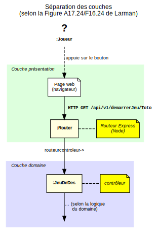
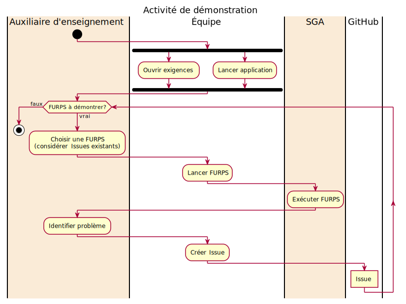
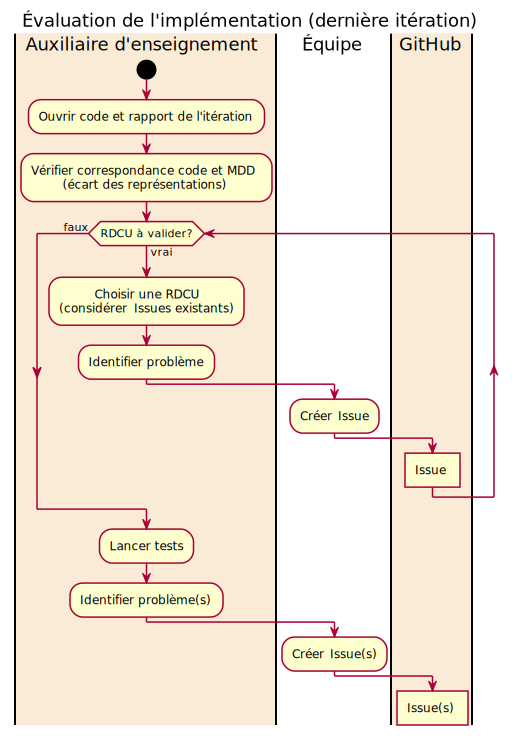

# Système de gestion de l'apprentissage

Version: Automne 2021 (1.0.0)  
Si vous trouvez des incohérences ou vous avez des questions, créez un [Issue](https://github.com/profcfuhrmanets/log210-enonce-lab1/issues).

## Introduction

Le laboratoire consiste à analyser, concevoir, implémenter et tester une solution pour satisfaire les besoins en ce qui concerne une application cliente. [Voir le document des exigences du client](README-exigences-client.md)

## Déploiement du système

Le diagramme suivant décrit les différentes parties du système. Nous cherchons à simplifier les aspects techniques qui ne sont pas le sujet principal du cours: cadres d'application frontale, services REST, utilisation de bases de données, etc.

Il faut que la solution respecte la séparation des couches présentation et domaine. Les opérations système doivent être le mécanisme pour traverser ces deux couches (pas de logique applicative dans la couche présentation). Pour vérifier cet aspect, la figure suivante est utile:

Notez que la logique du routeur (web) est simple :

* décortiquer l'argument, p. ex. nom, de la requête et
* appeler une opération système, p. ex. `demarrerJeu(nom)`, qui est une méthode définie dans une classe (le contrôleur GRASP) dans la couche domaine.

[Cette petite présentation](https://log210-cfuhrman.github.io/log210-valider-architecture-couches/#/) vous donne d'autres astuces pour valider votre solution sur le plan de la séparation des couches.

## Documents de référence

### Squelette pour commencer le SGA

En plus du [squelette](https://github.com/profcfuhrmanets/log210-jeu-de-des-node-express-ts/tree/master/docs/Squelette.md) de démarrage de projet pour Node.js, des [exemples de code supplémentaires](https://github.com/profcfuhrmanets/exemples-ts) pour vous aider dans votre projet sont aussi disponibles.

> Les solutions impliquant les langages et technologies autres que ceux dans le squelette ne sont pas permises.

Beaucoup de cadres d'application Web sont faciles à utiliser pour une application simple, mais il n'est pas toujours possible d'appliquer une bonne conception lorsqu'il s'agit d'une application complexe. Pour le respect des aspects importants de la conception (séparation des couches, opérations système avec contrôleur indépendant, possibilité d'avoir des modèles du domaine complexes, etc.), **vous ne pouvez pas utiliser les technologies/solutions suivantes :**

* Cadre d'application d'interface utilisateur: Vue.js, React, Angular, etc.
* Base de données: SQL et NoSQL

### SGB

Le système de gestion des bordereaux des étudiants (SGB) est un système externe utilisé par votre application pour récupérer les informations sur les enseignants, les cours, les étudiants ainsi que sauvegarder les notes obtenues par les étudiants lors de la réalisation d'un questionnaire ou la correction d'un devoir. **Vous n'avez pas à modifier ce système.**

SGB est une application ayant son propre modèle du domaine (comprenant les concepts comme l'université, les cours, les groupes-cours, les étudiants, les évaluations. Bien que votre application SGA ne traite que l'aspect pédagogique en ligne, votre analyse de SGA doit comprendre les classes conceptuelles de SGB.

<b>Cliquez ici pour voir les détails sur le MDD du SGB</b>

[Fichier source en PlantUML](https://raw.github.com/profcfuhrmanets/log210-jeu-de-des-node-express-ts/master/docs/modeles/mdd_sgb_sga.puml)

Veuillez noter que l'implémentation proposée de ce système n'a aucun mécanisme de persistance des données. Il possède une interface de configuration permettant de nettoyer le contenu correspondant aux notes.

L'API de SGB est disponible avec [le code source](https://github.com/yvanross/log210-systeme-gestion-bordereau-node-express-ts).
Lisez le README.md de SGB pour savoir comment générer cette documentation.

## Travail d'équipe

Ce texte est normalement un extrait du plan de cours:

> Chaque membre d'équipe est responsable de la totalité du travail réalisé et remis par son équipe. Toutefois, les membres de l'équipe ayant réalisé un travail peuvent décider de ne pas mettre sur le rapport le nom d’un ou de plusieurs autres membres qui n'ont pas fait une contribution (conception et codage) significative à l’itération. **Avant la remise du travail**, un courriel doit être envoyé en copie conforme à tous les membres de l’équipe, aux auxiliaires d'enseignement ainsi qu’à l’enseignant pour indiquer les raisons du retrait du nom. Un membre de l'équipe dont son nom n'est pas sur un travail de laboratoire reçoit une note de "0" pour le travail.

## Application frontale et persistance minimalistes

Vous devez implémenter une interface utilisateur minimaliste pour la réalisation de chacun des cas d'utilisation. Le but du laboratoire étant d'appliquer la méthodologie d'analyse et de conception enseignée dans LOG210, le squelette à un mécanisme simple pour faire l'application frontale. Il s'agit des gabarits HTML (pug, etc.) plutôt qu'un cadriciel complexe comme Angular.js, React, Vue, etc. Pour la même raison, les technologies de bases de données ne sont pas proposées pour la solution. Il est possible de réaliser le laboratoire sans passer du temps sur ces aspects que vous verrez plus en profondeur dans d'autres cours spécialisés.

## Déroulement des itérations

Chaque itération nécessite un avancement (**évolution**) sur le plan des exigences par une **valeur minimale** indiquée.

* Itération 1 - 3 points
* Itération 2 - 3 points supplémentaires
* Itération 3 - 4 points supplémentaires

Les points associés à chaque exigence sont définis dans la [grille de correction](https://docs.google.com/spreadsheets/d/17Ks_0Q60R8Ti1CMTIYo9Pw6gUO_OS8Wf?rtpof=true&authuser=cc-yvan.ross%40etsmtl.net&usp=drive_fs).

Cet avancement est prévu dans les objectifs du plan d'itération et sera évalué lors de la démonstration.

## Déroulement des corrections interactives

Les corrections interactives à chaque itération se déroulent selon le processus suivant.
Les auxiliaires d'enseignement veillent au bon déroulement de la correction, mais ce sont les étudiants qui doivent prendre l'initiative de suivre ces étapes à la lettre.

### Démonstration

L'objectif de cette partie est de montrer le fonctionnement de l'application au client et de documenter sa rétroaction dans la section **Évaluation** du plan d'itération.
Dans le plan d'itération, vous identifiez des critères d'évaluation.
Ces critères d'évaluation seront considérés lors de la démonstration.
La démonstration se déroule selon les étapes suivantes :

#### Évaluation de la conception et des tests

L'objectif de cette partie et de montrer que l'application est conforme aux principes vus en classe et à la conception des étudiants. Elle suit les étapes suivantes :

* Vérifier correspondance code et RDCU
    1. une méthode avec le même nom est présente dans un routeur. Elle doit :
        1. commencer par /api/v1
        2. utiliser le verbe REST approprié
        3. extraire et convertir et vérifier la présence des paramètres de la requête HTTP
        4. faire un seul appel à la méthode du contrôleur et retourne sa réponse sous forme de JSON avec le code HTTP approprié
        5. intercepter et traiter les erreurs adéquatement
        6. :warning: [Cette méthode ne doit pas retourner une vue](https://github.com/profcfuhrmanets/log210-jeu-de-des-node-express-ts/wiki/Vue-sans-route-d'API-(endpoint)). Pour ce faire, il faut faire une autre route qui appelle l'opération système.
    2. une méthode avec la même signature est présente dans un contrôleur.
       1. L'opération du contrôleur ne doit pas utiliser d'objets comme paramètres (exception: [le réusinage "Introduce Parameter Object"](https://refactoring.com/catalog/introduceParameterObject.html))
       2. Le retour d'opération correspond à une valeur primitive
* exécuter les tests
  1. des tests pour vérifier le scénario principal, les scénarios alternatifs et la gestion des erreurs de l'opération système sont présents. Ils doivent :
        1. être exécutés pour montrer leur fonctionnement
        2. appeler la route appropriée
        3. vérifier son code HTTP
        4. vérifier chacun des champs de la réponse

## Processus d'évaluation des laboratoires

Le travail de laboratoire sera évalué en deux volets, soit la partie **rapport et planification** et la partie **implémentation**.

Voir la grille de correction pour plus de détails.

| Évaluation               | Itération 1 | Itération 2 | Itération 3 |    Total    |
| :----------------------- | :---------: | :---------: | :---------: | :---------: |
| Rapport et planification |      a      |      b      |      c      | (a + b + c) |
| Implémentation           |      -      |      -      |      d      |      d      |

### Rapport et planification

Les critères d'évaluation de chaque itération (a, b, c) sont documentés dans la section [modalités d'évaluation](#modalités-dévaluation).

### Implémentation

Vous recevrez une rétroaction vers la fin de chaque itération, selon le processus itératif et évolutif. Notez que seulement l'évaluation (d) de la dernière itération comptera pour la note. De cette manière, on peut réduire les conséquences négatives des erreurs de planification et des difficultés avec la maîtrise des nouvelles technologies qui sont normales au début du projet.

Cependant, il peut y avoir une pénalité à la fin d'une itération si les critères de la grille de pointage ne sont pas respectés.

Le calcul de la note pour cette évaluation est le suivant :

> 

Le nombre de points minimal requis pour une note de 100% correspond au tableau suivant:
|Nombre d'étudiants| NbPoints|
|---|---|
|3| 8.25|
|4|11.00|
|5|13.75|
|6|16.50|

Vous pouvez implémenter plus de points pour compenser les pertes durant la correction, mais la note maximale sera de 100%.

Pour les valeurs de *d* dépassant 100&nbsp;%, le maximum est 110&nbsp;%.

Si une équipe ne réussit pas à répondre adéquatement à une exigence (fonctionnalité, tests, correspondance aux artéfacts), cette dernière ne sera pas utilisée dans le calcul.

### Dates de remises

Notez que le calendrier des séances est différent pour chaque groupe-cours, mais les dates de remises suivent cette planification. Le rapport doit être prêt pour la démo afin de montrer la correspondance entre la conception et la solution.

| Itération | Plan d'itération      | Démo / Rapport  |
| --------: | :-------------------- | :-------------- |
|         1 | Fin séance 3 du labo  | Début séance 6  |
|         2 | Fin séance 7 du labo  | Début séance 9  |
|         3 | Fin séance 10 du labo | Début séance 12 |

<!-- Ce point est essentiel pour le BCAPG, car on mesure la partie "évaluation" des rapports -->
**Note:** le Plan d'itération doit être actualisé après l'évaluation et vous devez faire un "commit" dans le dépôt sur GitHub. C'est-à-dire qu'il faut compléter la section Évaluation du plan actuel et le remettre *avant* de faire le prochain plan.

### Correction interactive du [rapport](rapports/RAPPORT-iteration-i.md) de l'itération 1

À la deuxième semaine de l'itération 1, vous devrez présenter les artéfacts, l'implémentation et les tests des CU01a et CU01b à votre auxiliaire d'enseignement. Vous recevrez des commentaires pour vous aider avant la remise de votre premier rapport et de votre première démo. Cette activité est informelle, mais votre participation est notée et obligatoire.

## Plan d'itération

Un plan d'itération doit être fait au début de chaque itération, suivant les conseils dans le [gabarit de plan d'itération](rapports/plan-iteration-gabarit.md).

### Pour planifier vos itérations

* [Comment planifier une itération selon le processus unifié](https://docs.google.com/a/etsmtl.net/document/d/1xeCCdR4-sTznTPaSKYIl4l_bQi-gE5stPWSA5VArRlY/edit?usp=sharing)

* [Comment estimer la taille d'une itération](https://docs.google.com/a/etsmtl.net/document/d/1bDy0chpWQbK9bZ82zdsBweuAgNYni3T2k79xihr6CuU/edit?usp=sharing)

### Compléter la section Évaluation

Après l'évaluation de votre itération, vous devez compléter la section **Évaluation** de votre plan.

## Modalités d'évaluation

Toutes les grilles d'évaluation se trouvent dans un chiffrier Google:

* [Pointage de tous les artéfacts](https://docs.google.com/spreadsheets/d/e/2PACX-1vSv41don0mUrXlng6Uk46yrKrKPZ1P4jbDLBi6qEO0s3pybZ93uAwBlkKqG6HD6AA/pubhtml?gid=502440678&single=true)
* [Plan d'itération](https://docs.google.com/spreadsheets/d/e/2PACX-1vSv41don0mUrXlng6Uk46yrKrKPZ1P4jbDLBi6qEO0s3pybZ93uAwBlkKqG6HD6AA/pubhtml?gid=1557747181&single=true)
* [Rapport](https://docs.google.com/spreadsheets/d/e/2PACX-1vSv41don0mUrXlng6Uk46yrKrKPZ1P4jbDLBi6qEO0s3pybZ93uAwBlkKqG6HD6AA/pubhtml?gid=146951737&single=true)
* [Implémentation](https://docs.google.com/spreadsheets/d/e/2PACX-1vSv41don0mUrXlng6Uk46yrKrKPZ1P4jbDLBi6qEO0s3pybZ93uAwBlkKqG6HD6AA/pubhtml?gid=1269446979&single=true)

## Conclusion

Vous ne devez implémenter que les cas d'utilisation que vous aurez spécifiés dans les objectifs de votre plan d'itération, mais vous pouvez utiliser le document d'exigences complet pour trouver l'information nécessaire à la réalisation de vos cas d'utilisation.

Assurez-vous que votre implémentation respecte la séparation des couches présentation et domaine.

Prenez note que nous sommes ouverts à toutes suggestions permettant d'apporter des améliorations au laboratoire. Nous analyserons chacune de vos suggestions.

Merci de votre participation et bon laboratoire.
